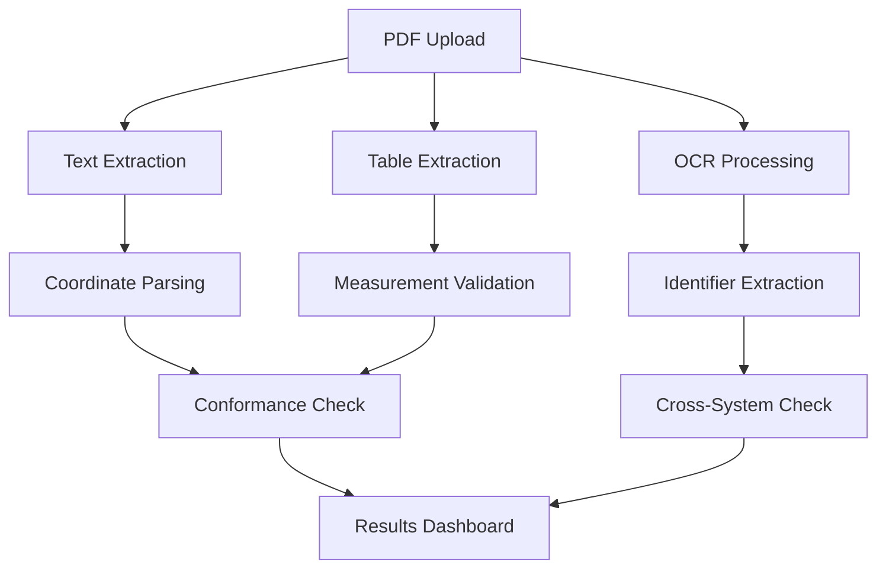

# 📐 ME PCPR AI-Powered Non-Conformity Checker


**Automated quality inspection tool** for validating mechanical measurement reports against technical drawings and certification documents with AI-powered OCR and cross-validation.

## 🌟 Key Features

### 🔍 Automated Validation
- **Nominal Value Matching**: Compare diagram coordinates with measurement reports
- **Tolerance Checking**: Validate measured values against specified tolerances
- **Date Validation**: Verify inspection dates are within certification period

### 📄 Advanced Document Processing
- **Multi-engine PDF parsing** (PyMuPDF, Tabula, OCR)
- **Handwritten/Stamped Text Recognition** with Tesseract & Keras-OCR
- **Table Extraction** from complex report layouts

### 🔗 Cross-System Verification
- 4-stage sequential identifier checking:
- Excel/CSV data integration
- Metadata consistency checks across documents

## 🚀 Getting Started

### Prerequisites
- Python 3.8+
- Java Runtime (for Tabula)
- Tesseract OCR 5.0+ ([Installation Guide](https://tesseract-ocr.github.io/tessdoc/Installation.html))

### Installation
Clone repository:
 ```bash
 git clone https://github.com/yourusername/me-pcpr-non-conformity-checker.git
 cd me-pcpr-non-conformity-checker
```
### Install Python dependencies
 ```bash
pip install -r requirements.txt
```

### Configure paths
``` bash
os.environ["JAVA_HOME"] = "your_java_path"  # e.g. "/usr/lib/jvm/java-11-openjdk-amd64"
pytesseract.pytesseract.tesseract_cmd = r"your_tesseract_path"  # e.g. "/usr/bin/tesseract"
```


